# 掃雷神隊友

想買新商品卻怕踩雷而卻步不前嗎？自從有了**掃雷神隊友**以後，就再也不用煩惱這個問題啦！透過查看前人們的踩雷經驗，就能快速知道這個商品是不是自己要的了。

- 設計一款手機APP，將前人對商品使用過的經驗存入資料庫，當掃描商品條碼時，即可快速地從資料庫中提取資料查看他人經驗，輕易地判斷出自己是否也要購買此商品，利用簡單的程式開發，解決永不踩雷的問題。

## 故事情境

1. 有天，小明餓著肚子走進便利商店，看見新上市的便當，決定買來嚐看看，吃了幾口後，發現便當不僅不合自己的胃口，份量小還吃不飽，這讓小明覺得很不值得購買。

2. 有天，小華走進便利商店時，看見小明看著便當發呆，在小華詢問小明並了解情況後，推薦小明下載手機程式，自從有了它，小明就能夠參考大家的評論，挑選出適合自己的商品

## 程式流程圖



## Pseudo Code

```python
def login():
  currentUser = tinyDB.get('currentUser')
  isLogin = bool(currentUser)
  if not isLogin:
    currentUser = google.oauth.login()
    tinyDB.store('currentUser', currentUser)

def logout():
  tinyDB.remove('currentUser')
  
def history(user):
  historyList = firebase.get(f'{ user }/history')
  render(historyList)
  
def rate():
  def getProduct(productID):
    return firebase.get(f'products/{ productID }')
  
  def startRating(productID):
    comment = new Comment()
    firebase.append(f'comments/{ productID }/comments', comment)

  productID = tinyDB.get('cachedProduct')
  isCache = bool(productID)
  
  if isCache:
    startRating(productID)
    return
  
  productID = scan()
  product = getProduct(productID)
  isExist = bool(product)
  if isExist:
    startRating(productID)
    return
 	
  product = new Product()
  firebase.store(f'products/{ productID }', product)
  startRating(productID)

```


## 主要功能

1. 按照事先規劃好的程式流程圖，編寫出整個程式
2. 功能：*登入驗證機制* , *登出機制* 完成
3. 功能：*建立商品資料* 完成
4. 功能：*建立評價資料* 完成
5. 功能：*到資料庫中取出商品資料並渲染頁面* 完成
6. 功能：*到資料庫中取出評價資料，並動態產生評論區* 完成
7. 功能：*暫存商品機制* 完成
8. 頁面：綜合以上程式功能，製作出"單純查看某商品資料與其評論區"頁面 完成
9. 頁面：*單純查看商品評價* 完成
10. 頁面：*查看我的歷史紀錄* 完成


### 動態產生評論區JSON模板

```json
{
  "name": "rating-template",
  "metadata-version": 1,
  "author": "NKUST",
  "platforms": [
    "App Inventor"
  ],
  "keys": [
    "id",
    "bg-color",
    "full-width",
    "user",
    "time",
    "score",
    "rating"
  ],
  "components": [
    {
      "id": "wrapper_{id}",
      "type": "VerticalArrangement",
      "properties": {
        "BackgroundColor": "{bg-color}",
        "Width": "{full-width}"
      },
      "components": [
        {
          "id": "user_{id}",
          "type":"Label",
          "properties": {
            "Text": "使用者：{user}"
          }
        },
        {
          "id": "time_{id}",
          "type":"Label",
          "properties": {
            "Text": "時間：{time}"
          }
        },
        {
          "id": "score_{id}",
          "type":"Label",
          "properties": {
            "Text": "評分：{score}"
          }
        },
        {
          "id": "rating_{id}",
          "type": "Label",
          "properties": {
            "Text": "評價：{rating}"
          }
        }
      ]
    }
  ]
}

```

### 動態產生歷史紀錄JSON模板
```json
{
  "name": "history-template",
  "metadata-version": 1,
  "author": "NKUST",
  "platforms": [
    "App Inventor"
  ],
  "keys": [
    "id",
    "bg-color",
    "full-width",
    "name",
    "name-width",
    "time",
    "time-width",
    "score",
    "score-width"
  ],
  "components": [
    {
      "id": "wrapper_{id}",
      "type": "HorizontalArrangement",
      "properties": {
        "BackgroundColor": "{bg-color}",
        "Width": "{full-width}"
      },
      "components": [
        {
          "id": "name_{id}",
          "type": "Label",
          "properties": {
            "Text": "{name}",
            "Width": "{name-width}"
          }
        },
        {
          "id": "time_{id}",
          "type": "Label",
          "properties": {
            "Text": "{time}",
            "Width": "{time-width}"
          }
        },
        {
          "id": "score_{id}",
          "type": "Label",
          "properties": {
            "Text": "{score}",
            "Width": "{score-width}"
          }
        }
      ]
    }
  ]
}

```